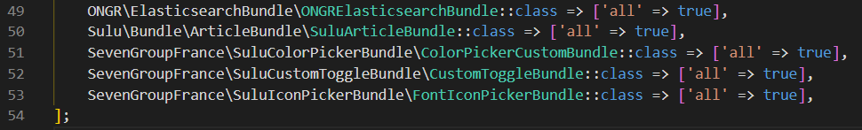
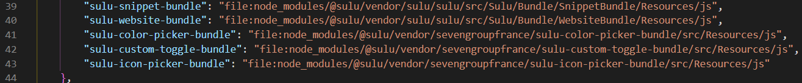
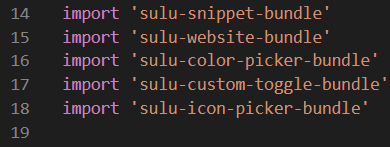

# sevengroupfrance/sulu-icon-picker-bundle

Inspired by [this pull request](https://github.com/sulu/sulu-demo/pull/66).

## What is this bundle's goal?
Importing a custom fonctionality into [sulu](https://github.com/sulu/sulu), in this example, a custom content type.\
This bundle will import an icon picker from the [react-fonticonpicker](https://www.npmjs.com/package/@fonticonpicker/react-fonticonpicker) npm package, as well as the icon libraries from [IcoMoon](https://icomoon.io/).

## Installation
1. Go to your `assets/admin` folder and install the react-switch npm package `npm i @fonticonpicker/react-fonticonpicker`.
2. Download the [package](https://packagist.org/packages/sevengroupfrance/sulu-icon-picker-bundle) in your project with the following command line:\
`composer require sevengroupfrance/sulu-icon-picker-bundle`.
3. In `config/bundles.php` add the following code:\
`SevenGroupFrance\SuluIconPickerBundle\FontIconPickerBundle::class => ['all' => true]`.

4. In `assets/admin/package.json`, add the following line in the "dependencies" object:\
`"sulu-icon-picker-bundle": "file:node_modules/@sulu/vendor/sevengroupfrance/sulu-icon-picker-bundle/src/Resources/js"`.

5. In `assets/admin`, `npm install` to initialize the bundle's symlink directory.
6. In `assets/admin/index.js`, add this line:\
`import 'sulu-icon-picker-bundle'`.

7. In `assets/admin`, `npm run watch` or `npm run build`

## Create your own icon list with IcoMoon

## Use in your template files
Once installed, to use this new content type, you'll have to create a new property with the type `custom_toggle`.

